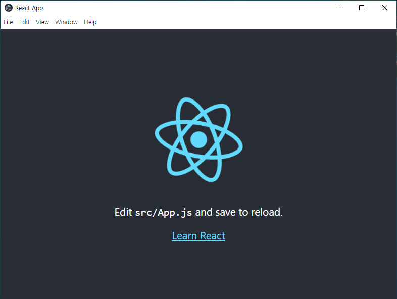

# Electron-react-basic setting

Welcome to Electron-react basic setting  
시작하기 위해선, 소스를 clone하고,  
터미널에서 __npm ci__ 혹은 __npm install__ 후,
__npm start__ 를 입력해주세요.

  

# 제작 과정 (terminal)  
// 폴더 생성  
\$ __mkdir Electron-react-basic__  
// 생성한 폴더로 이동  
\$ __cd Electron-react-basic__  
// 리액트 프로젝트 생성  
\$ __npx create-react-app .__  
// electron,  
// concurrently(react와 electron이 한 명령어로 동시에 실행되게끔 하기 위함),  
// wait-on(react 실행 후, electron이 실행되게끔 하기 위함)을 설치  
\$ __npm i -D electron concurrently wait-on__  
// package.json 파일에서 scripts부분 수정 및 "main": "main.js" 추가  
<code>
"scripts": {  
  "start": "concurrently \"npm:start-react\"   \"npm:start-electron\"",  
  "build": "react-scripts build",  
  "start-react": "react-scripts start",  
  "start-electron": "wait-on http://localhost:3000 && electron ."  
},  
</code>  

main.js파일 생성 및 Electron 코드 작성  

// npm start 명령어로 동작 확인  
\$ __npm start__
